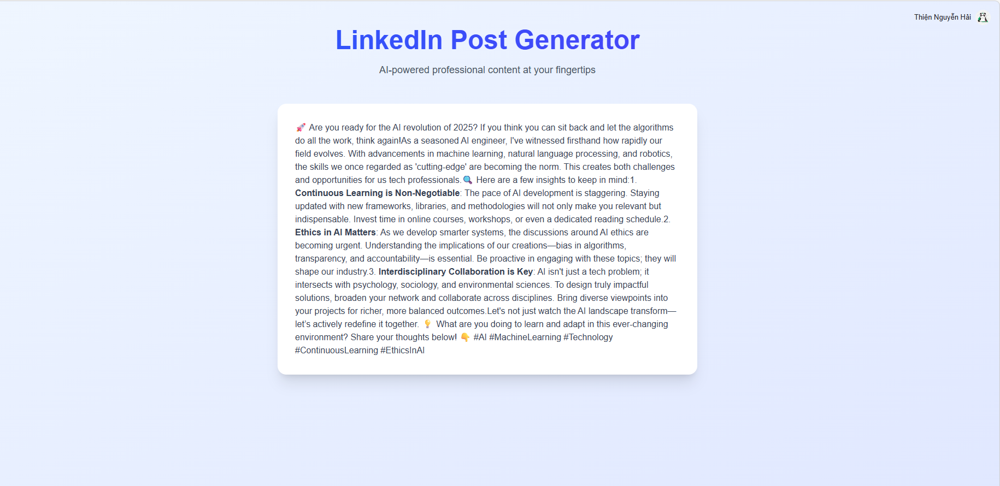

# AI LinkedIn Post Generator

AI LinkedIn Post Generator is a production-grade AI-powered tool designed for professionals in AI and technology. The system leverages OpenAI's GPT models to generate high-quality, insightful, and engaging LinkedIn posts tailored to a technical audience, complete with streaming responses for a seamless user experience.

---

## Project Status

**Status: Active (Production Ready)**

| Layer | Status | Description |
|-------|--------|-------------|
| **Frontend** |  | Next.js 16 + React 19 + Tailwind CSS 4 |
| **Backend** |  | FastAPI + OpenAI Streaming |
| **Auth** |  | Integrated with @clerk/nextjs |

---

## System Architecture

### Main Dashboard


### LinkedIn Post Generator



---

## Table of Contents

1. [Features](#1-features)
2. [Architecture](#2-architecture)
3. [Project Structure](#3-project-structure)
4. [Prerequisites](#4-prerequisites)
5. [Installation and Setup](#5-installation-and-setup)
6. [API Overview](#6-api-overview)

---

## 1. Features

- **Professional AI Personas**: Generates content specifically for AI engineers, data scientists, and tech founders.
- **Streaming Content Delivery**: Real-time post generation using Server-Sent Events (SSE).
- **Curated Prompts**: Optimized AI prompts to ensure conversational, insightful, and non-generic content.
- **Secure Authentication**: Protected routes and user identity management using Clerk.
- **Modern Tech Stack**: Built with React 19, Next.js 16, and Tailwind CSS 4.

---

## 2. Architecture

### Backend (FastAPI)

The backend orchestrates the AI logic and streaming delivery:
1. **OpenAI Integration**: Uses `gpt-4o-mini` with custom instructions for LinkedIn-optimized formatting.
2. **Streaming Protocol**: Implements `StreamingResponse` to push text chunks to the frontend in real-time.
3. **Clerk Security**: Verifies JWT tokens from the frontend to ensure authorized access.

### Tech Stack

- **AI/LLM**: OpenAI GPT-4o-mini.
- **Backend**: FastAPI, Uvicorn, Python 3.12.
- **Frontend**: Next.js 16 (App Router), React 19, Tailwind CSS 4.
- **Auth**: Clerk (Next.js & FastAPI).

---

## 3. Project Structure

```text
ai-linkind/
├── assets/                     # Media and demo assets
│   ├── home_linked_ai.png      # Dashboard screenshot
│   └── linked_generator.png    # Generator screenshot
├── backend/                    # FastAPI Backend
│   ├── main.py                 # API logic and AI streaming
│   ├── .env                    # Environment variables
│   └── requirements.txt        # Python dependencies
├── frontend/                   # Next.js Frontend
│   ├── app/                    # Next.js 16 App Router
│   ├── components/             # UI Components
│   ├── .env.local              # Frontend environment variables
│   └── package.json            # Node.js dependencies
└── README.md                   # Project documentation
```

---

## 4. Prerequisites

- **Python 3.12+** (Anaconda recommended)
- **Node.js 18+**
- **OpenAI API Key**
- **Clerk Account** (Publishable Key and Secret Key)

---

## 5. Installation and Setup

### Step 1: Clone the Repository

```bash
git clone https://github.com/adamwhite625/ai-linkind.git
cd ai-linkind
```

### Step 2: Backend Setup (Anaconda)

```bash
# Create and activate environment
conda create -n ai_linkedin python=3.12 -y
conda activate ai_linkedin

# Install dependencies
cd backend
pip install -r requirements.txt

# Setup environment variables
cp .env.example .env
# Edit .env and fill in your OPENAI_API_KEY and CLERK_JWKS_URL
```

### Step 3: Frontend Setup

```bash
cd ../frontend
npm install

# Setup environment variables
cp .env.example .env.local
# Edit .env.local and fill in your Clerk keys
```

### Step 4: Run the Application

**Start the Backend:**
```bash
cd ../backend
uvicorn main:app --reload
```

**Start the Frontend:**
```bash
cd ../frontend
npm run dev
```

The application will be available at `http://localhost:3000`.

---

## 6. API Overview

All API requests are prefixed with `/api`.

| Category | Endpoint | Action |
|----------|----------|--------|
| **Generation** | `GET /api/generate` | Generates and streams a LinkedIn post |

The `/api/generate` endpoint requires a valid Clerk authentication token and returns a `text/event-stream`.
